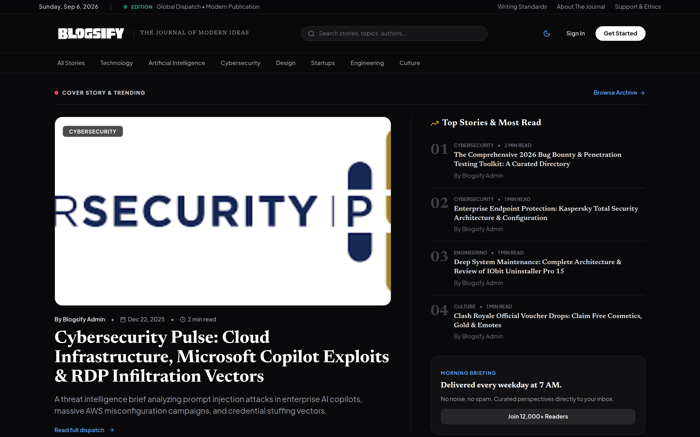
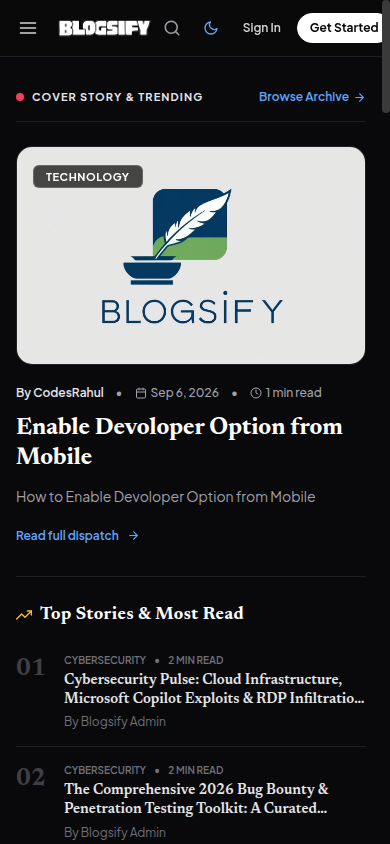

# ✍️ Blogsify

> A modern, distraction-free blogging platform for developers, designers, and creators to share ideas and perspectives.

🌐 **Live Demo:** [blogsify.indevs.in](https://blogsify.indevs.in/)

---

## 📸 Preview

| Desktop View | Mobile View |
| :---: | :---: |
|  |  |

---

## ✨ Features

- **Distraction-Free Reading:** Clean typography, beautiful dark & light mode, reading time estimates, and smooth animations.
- **Rich Markdown Editor:** Write posts with full Markdown support, code syntax, tables, and inline images.
- **Video Embeds:** Built-in player for YouTube, Vimeo, and direct video links.
- **Topic Tags & Categories:** Filter stories effortlessly by category or curated tags.
- **Writer & Admin Dashboards:** Manage your articles, drafts, and profile, with full analytics and user management for admins.
- **Fast & Responsive:** Instant page loads with client-side caching, optimized database queries, and a 100% mobile-friendly layout.

---

## 🛠️ Tech Stack

- **Frontend:** React 19, Vite, Tailwind CSS, Framer Motion, React Markdown
- **Backend:** Node.js, Express, MongoDB Atlas, Mongoose, JWT Authentication
- **Hosting:** Netlify (Frontend) & Vercel (Backend)

---

## 🚀 Quick Start

Get Blogsify running locally in 3 simple steps:

### 1. Clone the repository
```bash
git clone https://github.com/CodesRahul96/Blogsify.git
cd Blogsify
```

### 2. Start the Backend
```bash
cd server
npm install
cp .env.example .env
npm run dev
```
> Configure your `MONGODB_URI` and `JWT_SECRET` in `server/.env`.
> The server runs on `http://localhost:5000`.

### 3. Start the Frontend
In a separate terminal:
```bash
cd client
npm install
cp .env.example .env
npm run dev
```
> The application will open at `http://localhost:5173`.

---

## ⚙️ Environment Variables

### Server (`server/.env`)
```env
PORT=5000
MONGODB_URI=your_mongodb_connection_string
JWT_SECRET=your_jwt_secret_key
FRONTEND_URL=http://localhost:5173
```

### Client (`client/.env`)
```env
VITE_BASE_URL=http://localhost:5000
```

---

## 🤝 Contributing

Contributions, issues, and feature requests are always welcome! Feel free to open an issue or submit a pull request.

---

## 📄 License

This project is open source and licensed under the [ISC License](LICENSE).
